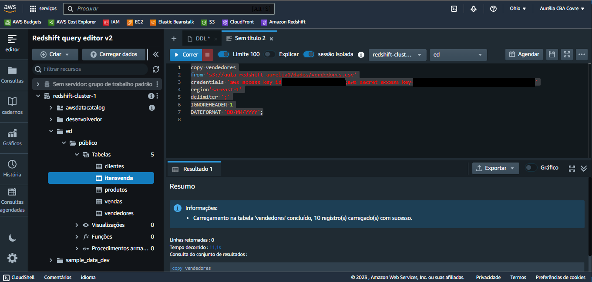
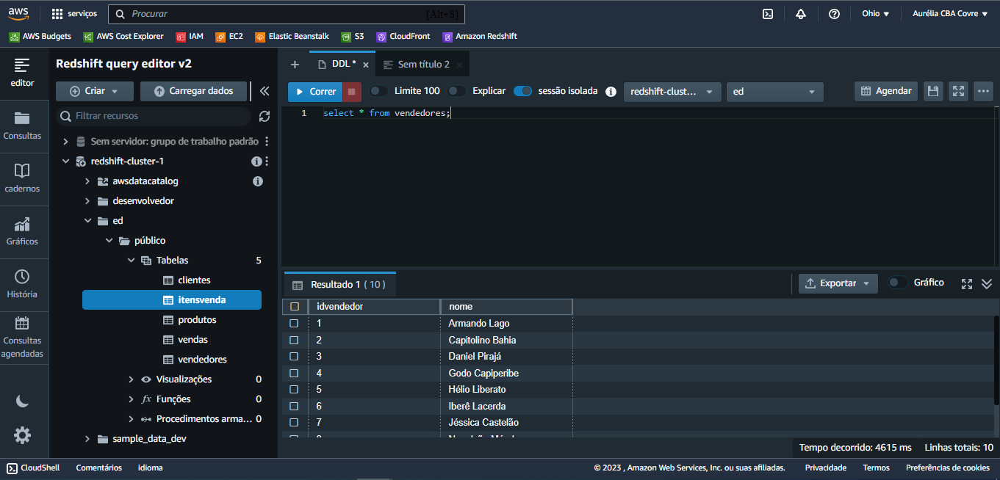
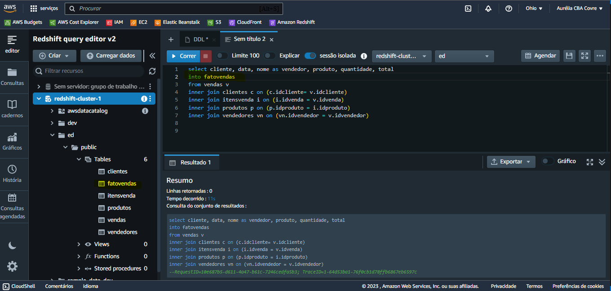
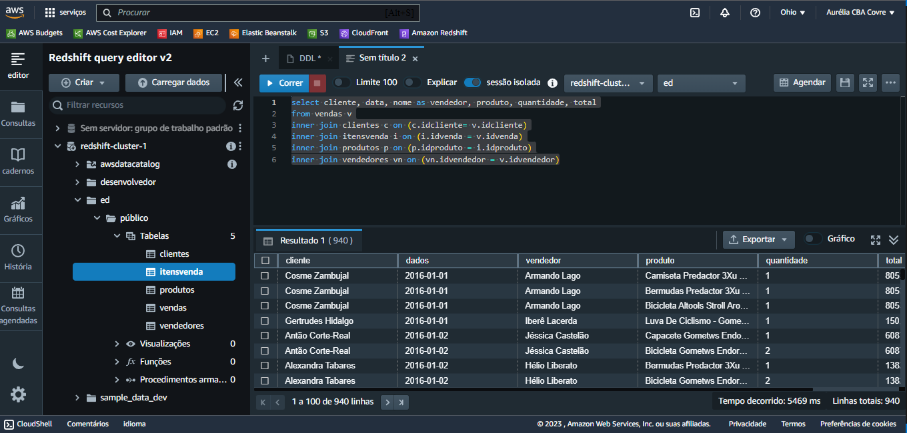
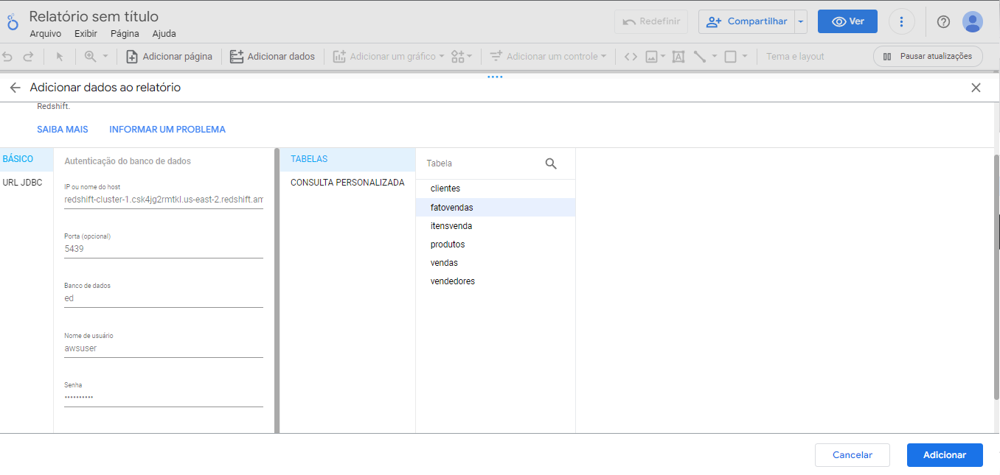
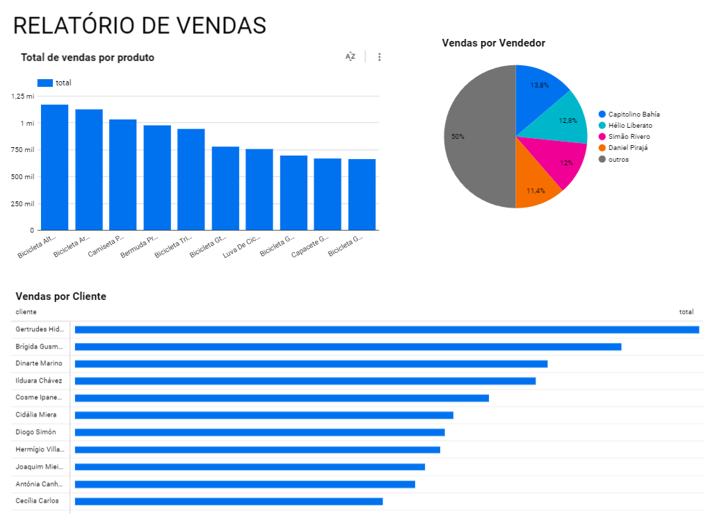

# Amazon Redshift

## Tecnologias Utilizadas

- Amazon Redshift
- Amazon S3
- Google Data Studio [clique aqui para acessar](https://lookerstudio.google.com/u/0/navigation/reporting)

## O que é o Amazon Redshift?

O Amazon Redshift é um serviço de Data Warehouse (DW) oferecido pela AWS. Ele é projetado para processar e analisar grandes volumes de dados de forma eficiente e escalável. O Redshift é especialmente adequado para executar análises complexas em dados históricos ou operacionais, proporcionando insights valiosos para os negócios.

A principal característica do Amazon Redshift é a sua capacidade de processar consultas SQL de maneira rápida e eficiente em grandes conjuntos de dados. Ele adota uma abordagem orientada a colunas em vez da arquitetura de linhas encontrada em bancos de dados relacionais convencionais. Isso permite que o Redshift otimize consultas, melhorando o desempenho ao ignorar colunas que não são necessárias para uma consulta específica.

Além disso, o Redshift é altamente escalável e pode ser dimensionado para atender a diferentes cargas de trabalho e tamanhos de dados. Ele também oferece recursos de segurança robustos, incluindo criptografia de dados em repouso e em trânsito, controle de acesso por login de usuário e integração perfeita com outros serviços da AWS.

## Roteiro

- [x] Criar um cluster no Amazon Redshift.
- [x] Utilizar o "Editor de Consultas v2" para interagir com o cluster.
- [x] Criar banco de dados e estruturas de tabelas [Consulte o script aqui](1_criacao_tabelas.sql).
- [x] Criar um bucket no Amazon S3 e anexar as tabelas.
- [x] Gerar chaves de acesso para permitir que o Redshift acesse o bucket S3 (encontre a opção em "Credenciais de Segurança" do seu usuário).
- [x] Carregar os dados, copiando a URI do S3 de cada arquivo [Consulte o script aqui](2_populando_tabelas.sql).

- [x] Criar uma tabela desnormalizada, concatenando as tabelas existentes para simplificar consultas [Consulte o script aqui](3_criando_fatovendas.sql).

- [x] Criar um Dashboard usando o Google Data Studio. Para isso, é necessário liberar o Redshift para acesso público, copiando o Endpoint.

- [x] Configurar regras de acesso específicas no grupo de segurança para garantir a segurança.

Para evitar cobranças não planejadas, exclua o cluster, o bucket e as chaves de acesso após a conclusão do projeto. Verifique se não há snapshots gerados e exclua-os, se necessário.

**Por [Aurélia Covre](https://github.com/AuréliaCovre)**